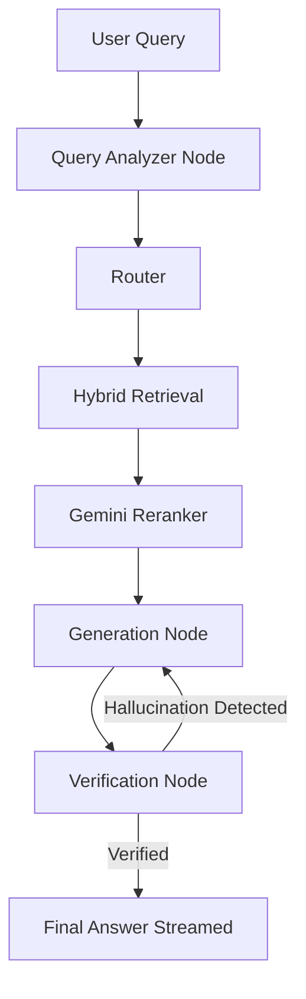
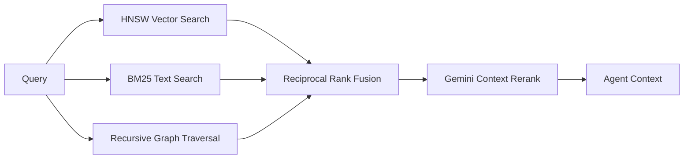

# Cura: Serverless Multi-Agent RAG Platform

Cura is a production-hardened Agentic RAG (Retrieval-Augmented Generation) platform. It solves the "lost in the middle" context problem and enforces strict citation provenance by replacing traditional linear RAG chains with a LangGraph state machine.

Built specifically to demonstrate staff-level engineering rigor, Cura features a distributed ingestion DAG, Reciprocal Rank Fusion (RRF), and robust concurrency controls capable of handling enterprise data safely within serverless limits.

## 🚀 Technical Highlights

* **Multi-Agent LangGraph Orchestrator:** Implements an autonomous, cyclic workflow. Agents dynamically extract entities, route queries, generate answers, and self-verify against source chunks—looping until hallucinations are eliminated.
* **Hybrid Search with RRF:** Fuses `pgvector` HNSW semantic search, Postgres BM25 full-text search, and recursive Graph Traversal using Reciprocal Rank Fusion to synthesize the optimal context window.
* **Distributed Async Ingestion:** Utilizes Inngest to map-reduce document parsing and graph extraction. Features strict rate limiting, event batching, and exponential backoff to respect downstream LLM quotas.
* **Concurrency-Safe Graph Storage:** Employs Postgres `ON CONFLICT DO UPDATE` schemas to guarantee idempotent insertions and prevent race conditions when thousands of chunks are ingested concurrently.
* **100% Serverless Architecture:** Node.js (Vercel) + Supabase + Gemini 1.5 Flash. Zero persistent infrastructure overhead.

## 🏛️ Architecture

* **Frontend:** Next.js 15 (App Router), React Server Components, Tailwind CSS.
* **Backend:** Next.js Route Handlers, Inngest (Serverless Queues).
* **Database:** Supabase (PostgreSQL, `pgvector`, Row Level Security).
* **AI Engine:** Gemini 1.5 Flash (via `@langchain/google-genai`).

### Agent Workflow (LangGraph)


### Retrieval Pipeline


## 📦 Local Setup

1. **Clone & Install**
   ```bash
   git clone https://github.com/Ayush-kathil/cura-assistant-RAG.git
   cd cura-assistant-RAG
   npm install
   ```
2. **Environment Variables**
   Create a `.env.local` file:
   ```env
   NEXT_PUBLIC_SUPABASE_URL=your_supabase_url
   NEXT_PUBLIC_SUPABASE_ANON_KEY=your_anon_key
   SUPABASE_SERVICE_ROLE_KEY=your_service_key
   GOOGLE_API_KEY=your_gemini_api_key
   INNGEST_EVENT_KEY=local
   INNGEST_SIGNING_KEY=local
   ```
3. **Database Migrations**
   ```bash
   npx supabase start
   npx supabase db push
   ```
4. **Run Development Server**
   ```bash
   npx inngest-cli dev
   npm run dev
   ```

*Disclaimer: This repository serves as an architectural demonstration of distributed AI systems engineering.*
