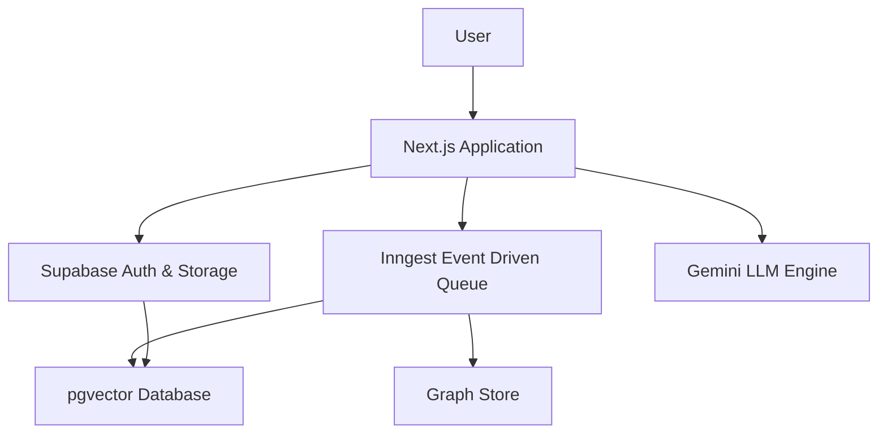
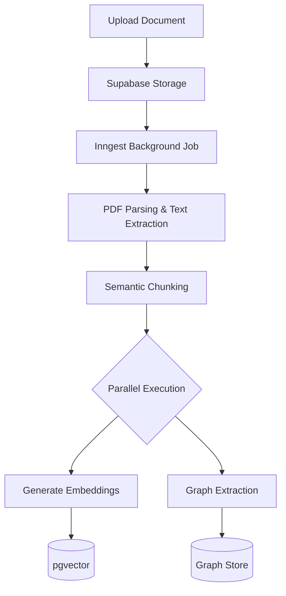
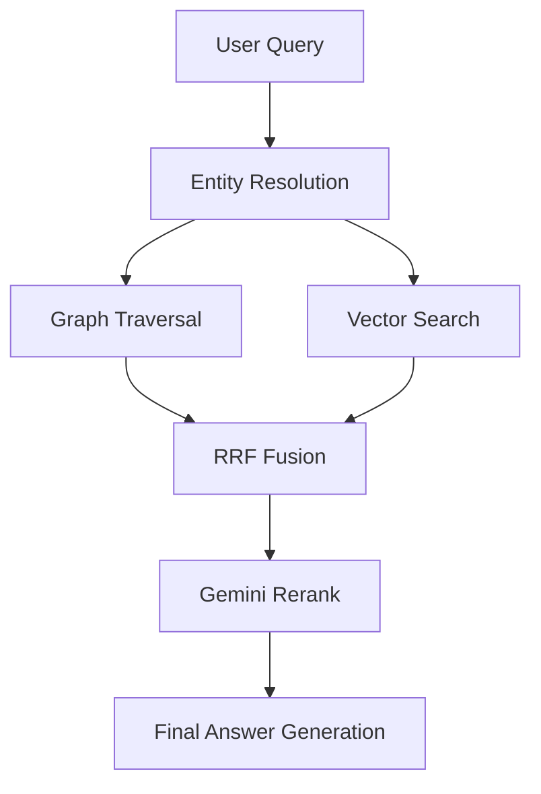
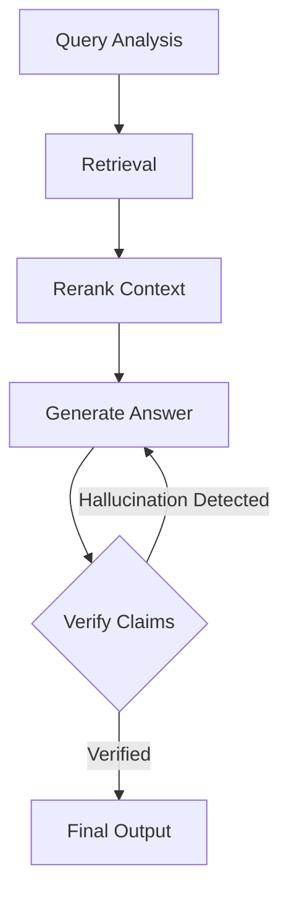

# Cura

**Enterprise-grade Agentic RAG Platform**

Cura is a production-hardened Agentic RAG (Retrieval-Augmented Generation) platform. It solves the "lost in the middle" context problem and enforces strict citation provenance by replacing traditional linear RAG chains with a LangGraph state machine.

Built specifically to demonstrate staff-level engineering rigor, Cura features a distributed ingestion DAG, Reciprocal Rank Fusion (RRF), and robust concurrency controls capable of handling enterprise data safely within serverless limits.

---

## 🚀 Key Features

* **Multi-Tenant Architecture:** Strict Row Level Security (RLS) ensuring 100% data isolation across users and workspaces.
* **Multi-Agent LangGraph Orchestrator:** Implements an autonomous, cyclic workflow. Agents dynamically route queries, generate answers, and self-verify against source chunks.
* **Hybrid Search with RRF:** Fuses `pgvector` HNSW semantic search and full-text search to synthesize the optimal context window.
* **Distributed Async Ingestion:** Utilizes Inngest to map-reduce document parsing and embedding extraction. Features strict rate limiting, event batching, and exponential backoff to respect downstream LLM quotas.
* **Concurrency-Safe Storage:** Employs Postgres `ON CONFLICT DO UPDATE` schemas to guarantee idempotent insertions and prevent race conditions when thousands of chunks are ingested concurrently.
* **100% Serverless Architecture:** Node.js (Vercel) + Supabase + Gemini 1.5 Flash. Zero persistent infrastructure overhead.

---

## 📸 Screenshots

*(Add screenshots of the Dashboard, Document Manager, and Chat Interface here)*

---

## 🏛️ Architecture Overview

Cura leverages a modern serverless stack to deliver enterprise-grade scalability and performance.

### Tech Stack
| Component | Technology | Purpose |
| :--- | :--- | :--- |
| **Frontend** | Next.js 15, React, Tailwind CSS | High-performance, responsive UI |
| **Backend** | Next.js Route Handlers, Inngest | Serverless API and background jobs |
| **Database** | Supabase (PostgreSQL) | Relational data, authentication |
| **Vector Store** | `pgvector` | HNSW semantic search |
| **AI Engine** | Gemini 1.5 Flash | Embeddings, reasoning, and generation |
| **Orchestration**| LangGraph | State machine for multi-agent workflows |

### Full System Architecture


---

## 📥 Ingestion Pipeline

The ingestion pipeline is designed for massive scale, safely chunking and embedding documents without hitting API rate limits or timing out serverless functions.

### Document Ingestion Pipeline


---

## 🔍 Retrieval Pipeline

Cura doesn't just do semantic search; it uses Reciprocal Rank Fusion (RRF) to combine multiple retrieval methods for unparalleled accuracy.

### Graph RAG Retrieval


### LangGraph Agent


---

## 🛠️ Local Setup

1. **Clone & Install**
   ```bash
   git clone https://github.com/Ayush-kathil/cura-assistant-RAG.git
   cd cura-assistant-RAG
   npm install
   ```

2. **Environment Variables**
   Create a `.env.local` file:
   ```env
   NEXT_PUBLIC_SUPABASE_URL=your_supabase_url
   NEXT_PUBLIC_SUPABASE_ANON_KEY=your_anon_key
   SUPABASE_SERVICE_ROLE_KEY=your_service_key
   GOOGLE_API_KEY=your_gemini_api_key
   GEMINI_API_KEY=your_gemini_api_key
   INNGEST_EVENT_KEY=local
   INNGEST_SIGNING_KEY=local
   ```

3. **Database Migrations**
   Make sure Docker is running, then execute:
   ```bash
   npx supabase start
   npx supabase db push
   ```

4. **Run Development Server**
   Start the Inngest dev server and Next.js app in separate terminals:
   ```bash
   # Terminal 1
   npx inngest-cli dev

   # Terminal 2
   npm run dev
   ```

---

## 🚀 Deployment Guide

1. **Supabase Production:**
   - Create a new project in Supabase.
   - Run `npx supabase db push --linked` to push the migrations.
   - Configure Authentication providers and Storage buckets.

2. **Vercel Deployment:**
   - Link the repository to Vercel.
   - Add all environment variables from `.env.local`.
   - Deploy.

3. **Inngest Setup:**
   - Sync your Vercel deployment with Inngest Cloud.
   - Ensure the `INNGEST_EVENT_KEY` and `INNGEST_SIGNING_KEY` are configured in Vercel.

---

## 🧠 System Design Decisions

1. **Multi-Tenant First:** Implemented deep Row Level Security (RLS) in PostgreSQL, tied to a canonical `workspace_id`, ensuring strict tenant isolation directly at the database level.
2. **Event-Driven Ingestion:** Moved heavy PDF parsing and embedding extraction to Inngest to bypass Vercel's 10-second serverless timeout limits.
3. **Idempotent Storage Operations:** Used `ON CONFLICT DO UPDATE` schemas to handle retry storms safely.
4. **LangGraph State Machine:** Chose a cyclic state machine over linear chains to enable self-correction, hallucination verification, and multi-step reasoning.

---

## 🗺️ Future Roadmap

- [ ] Connect custom external data sources (Notion, Google Drive, Slack)
- [ ] Implement advanced Graph RAG with dedicated Graph Database
- [ ] Enterprise SSO and SAML Integration
- [ ] Advanced usage analytics and token tracking per workspace
- [ ] Real-time collaborative document editing and annotation

---

*Disclaimer: This repository serves as an architectural demonstration of distributed AI systems engineering.*
