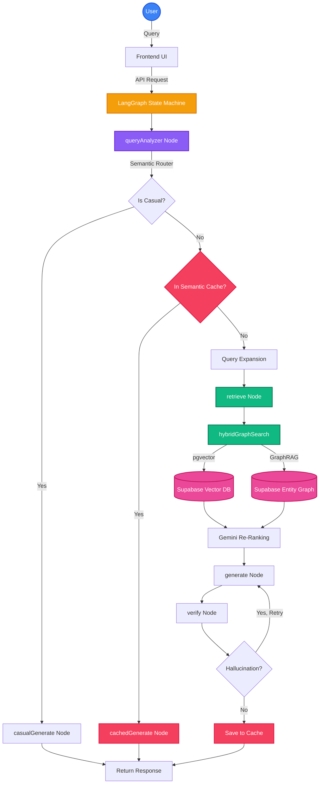

# Cura

Cura is an AI companion built to help you extract insights from your documents using a custom Retrieval-Augmented Generation (RAG) pipeline. 

Rather than relying on basic linear prompts, Cura uses an intelligent, multi-step LangGraph state machine. It evaluates your query, decides whether it needs to search your documents, retrieves the right context using hybrid search, and then—crucially—verifies its own answers. If it catches itself hallucinating or missing the mark, it rewrites the query and tries again before ever showing you the result.

## 🏗️ How it Works under the Hood

Here is the structural diagram of Cura's RAG pipeline:



## Features
- **Self-Correcting RAG:** Cura verifies its generations against the retrieved context. If the answer isn't fully supported, it loops back and rewrites the query to find better context.
- **Context Compression:** Large contexts are compressed dynamically so the language model focuses strictly on the most relevant information, saving time and tokens.
- **Hybrid Search Pipeline:** A mix of exact keyword matching and semantic vector search (`pgvector`) ensures high precision.
- **Responsive Workspace UI:** A clean, minimal chat interface optimized for both desktop and mobile, with intelligent auto-scrolling, a collapsible sidebar, and a dedicated resource manager.
- **Secure Data Isolation:** All workspaces are protected by strict Row-Level Security in Supabase.

## Local Setup

If you'd like to run Cura locally, here is what you need to do:

1. **Clone & Install dependencies**
   ```bash
   git clone https://github.com/Ayush-kathil/cura-assistant-RAG.git
   cd cura-assistant-RAG
   npm install
   ```

2. **Configure your Environment**
   Create a `.env.local` file at the root of the project with your keys:
   ```env
   NEXT_PUBLIC_SUPABASE_URL=your_supabase_url
   NEXT_PUBLIC_SUPABASE_ANON_KEY=your_anon_key
   SUPABASE_SERVICE_ROLE_KEY=your_service_key
   GOOGLE_API_KEY=your_gemini_api_key
   GEMINI_API_KEY=your_gemini_api_key
   INNGEST_EVENT_KEY=local
   INNGEST_SIGNING_KEY=local
   ```

3. **Start the Database**
   Ensure Docker is running, then pull and start the Supabase containers:
   ```bash
   npx supabase start
   npx supabase db push
   ```

4. **Run the Servers**
   You'll need two terminal windows to run both the Next.js app and the Inngest background job server:
   ```bash
   # Terminal 1
   npx inngest-cli dev

   # Terminal 2
   npm run dev
   ```

Visit `http://localhost:3000` and enjoy!

---
*Built for scale. Designed for humans.*
